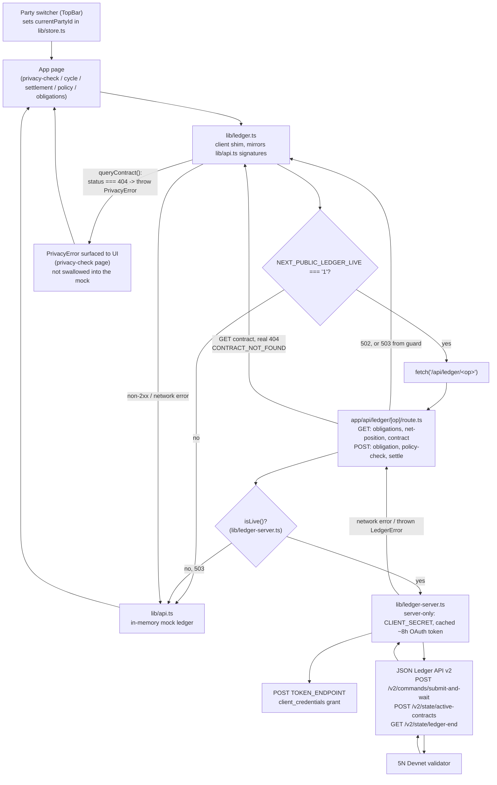
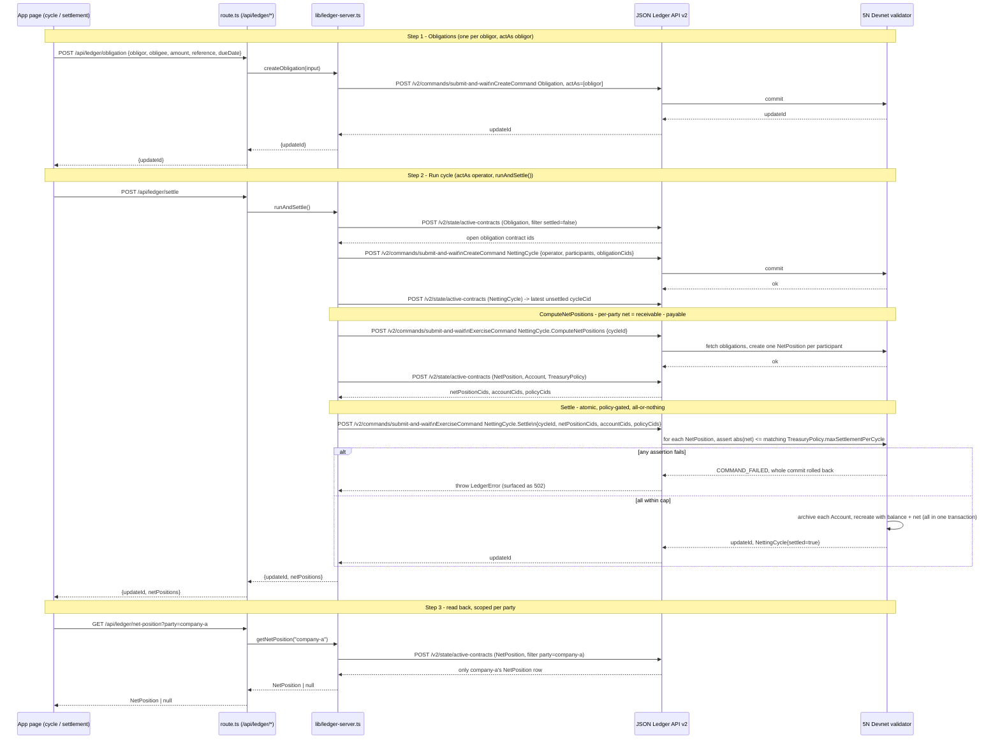

# NetChain Architecture

NetChain is a privacy-preserving multilateral netting and atomic settlement demo running on a Canton (5N) Devnet validator, fronted by a Next.js 14 app. A single operator party (the netting bank) holds every `Account` and runs each netting cycle; the three counterparties (`company-a/b/c`) never see each other's obligations or net positions on the ledger, only their own. The frontend talks to the ledger through one thin client shim, a server-only route layer, and a JSON Ledger API v2 client that holds the M2M credentials; every call degrades to a local mock when the ledger isn't configured or a request fails, except for a genuine per-party projection miss, which surfaces as a real privacy error instead of being swallowed.

## 1. Request flow: browser to validator and back

Key code references:
- `lib/ledger.ts`: `getObligationsFor`, `queryContract`, `getNetPositionFor`, `checkPolicy`, `createObligationLive`, `settleLive`. Only `queryContract` treats HTTP 404 as a real `PrivacyError`; every other failure (non-OK response, thrown exception) falls through to the corresponding function in `lib/api.ts`.
- `app/api/ledger/[op]/route.ts`: `guard()` returns 503 when `isLive()` is false, which is exactly the signal `lib/ledger.ts` treats as "fall back to mock." `fail()` maps any thrown error to 502.
- `lib/ledger-server.ts`: `isLive()` requires `BASE`, `PKG`, `CLIENT_SECRET`, and all four `NETCHAIN_*` party ids to be set. `token()` caches the OAuth token for 7h (tokens live ~8h). `post()` treats a JSON body with both `code` and `cause` as an error per the JSON Ledger API's error shape.

## 2. Netting cycle sequence: obligations to settlement

This mirrors `runAndSettle()` in `lib/ledger-server.ts`: create obligations, create a `NettingCycle`, exercise `ComputeNetPositions`, then exercise `Settle` with the fetched `netPositionCids` / `accountCids` / `policyCids`. The `Settle` choice in `daml/daml/NetChain.daml` asserts every party's `abs(net)` is within its `TreasuryPolicy.maxSettlementPerCycle` before archiving and recreating any `Account`; a failed assertion rolls back the entire transaction, so no balance ever moves partially. On the live 5N Devnet run this produced settled balances A=115k, B=130k, C=55k, with nets +15k/+30k/-45k summing to zero.

## 3. UI action to endpoint to template to actAs

| UI action | Page | `lib/ledger.ts` call | Route (`app/api/ledger/[op]`) | `lib/ledger-server.ts` fn | Daml template / choice | `actAs` |
|---|---|---|---|---|---|---|
| Load "your projection" | `app/app/privacy-check/page.tsx` | `getObligationsFor` | `GET /api/ledger/obligations?party=` | `listObligations` | `Obligation` (ACS query) | current party |
| Query a foreign contract | `app/app/privacy-check/page.tsx` | `queryContract` | `GET /api/ledger/contract?party=&contractId=` | `getContract` | `Obligation` (ACS query, filtered) | current party (404 = `PrivacyError`) |
| View your net position | `app/app/cycle/page.tsx` (party view) | `getNetPositionFor` | `GET /api/ledger/net-position?party=` | `getNetPosition` | `NetPosition` (ACS query) | current party |
| Create an obligation (agent or manual) | `app/app/obligations/page.tsx` | `createObligationLive` | `POST /api/ledger/obligation` | `createObligation` | `Obligation` (create) | obligor |
| Agent over-threshold attempt | `app/app/policy/page.tsx` | `checkPolicy` | `POST /api/ledger/policy-check` | `checkPolicy` | `TreasuryPolicy.CheckSettlement` (exercise) | operator |
| Run netting cycle + settle | `app/app/cycle/page.tsx`, `app/app/settlement/page.tsx` | `settleLive` | `POST /api/ledger/settle` | `runAndSettle` | `NettingCycle` create, `ComputeNetPositions`, `Settle` | operator |

Note: the netting cycle's client-visible math (`computeNetPositions`, `buildSettlementLegs` on `app/app/cycle/page.tsx`) runs against the local mock state for the animated demo UI; `settleLive()` separately runs the real `Settle` on-ledger and the resulting `updateId` (or a mock tx hash, `newTxHash`, when not live) is what the settlement page displays as the transaction hash.
